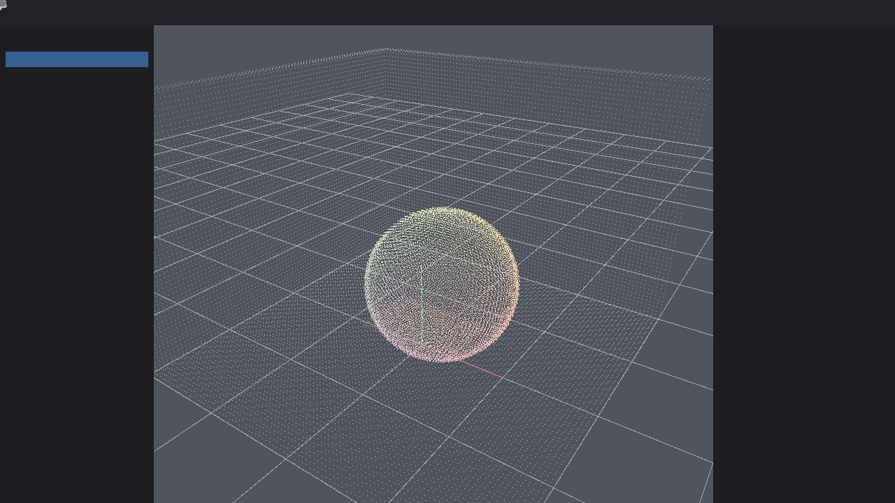

# Create3D



Create3D is an AI-native, GPU-native, cloud-native 3D creation platform built in Rust.

This repository is in **Beta (0.1.4-beta)**: open any project directory, export GLB/USD snapshots, remote Copilot LLM integration, URDF external mesh import, live ROS2 sidecar bridge, and CI release artifacts on version tags.

## Architecture

- SceneDB is authoritative; ECS is a runtime projection.
- All scene edits are typed transactions.
- Assets are content-addressed in `assets/blobs/` with an index manifest.
- Renderer code depends on `c3d-rhi`, not a backend directly (egui bootstrap in desktop is the only exception).
- AI agents mutate scenes only through typed tools.

See `Create3D/docs/architecture/create3d_master_architecture_design.md` for the full master design.

## Build

```bash
cargo test --workspace
cargo run -p xtask -- check
cargo run -p xtask -- package   # release binaries
cargo run -p xtask -- samples   # regenerate sample projects
cargo run -p xtask -- bench     # scene replay benchmark
```

## Desktop editor

```bash
cargo run -p create3d-desktop
```

The window includes Month 5/6 interaction tools plus Month 7 point cloud, Month 8 Gaussian splat, Month 9 Copilot, Month 10 robotics, and Month 11 collaboration features:

- **Import PLY**: toolbar button or command palette (`Import PLY Point Cloud`); auto-detects 3DGS PLY when using the generic PLY button
- **Import 3DGS PLY**: toolbar button or command palette (`Import 3DGS PLY`)
- **Import URDF**: toolbar button or command palette (`Import URDF`); builds link/joint hierarchy with primitive visuals
- **Robotics panel**: topic list, TF tree, live joint states, mock bridge, sidecar bridge start/stop
- **Collaboration panel**: sync server connect, presence, entity comments, branch proposals (including Copilot)
- **Point cloud viewport**: chunked GPU upload with residency (only nearby chunks are uploaded)
- **Gaussian splat viewport**: alpha-blended splat quads with opacity/size scales and crop filters
- **Copilot panel**: ask scene questions, preview AI-proposed transactions, approve/reject before commit
- **Color modes**: RGB, Intensity, Classification (point clouds)
- **Crop filter**: scene-level crop box in the inspector (point clouds and Gaussian splats)
- **Derived crop asset**: create a cropped asset from the selection
- **Create primitives / shading / material inspector / thumbnails** from Month 6
- **Hierarchy / Inspector / Gizmo / Command palette** from Month 5

Imported GLB meshes render with base color and baked base-color textures. The desktop app persists a demo project under the system temp directory.

Copilot examples (local mock without API key; remote LLM with `CREATE3D_COPILOT_API_KEY`):

- `how many entities?`
- `what is selected?`
- `move up 1` (requires selection; preview then Approve)
- `rename to Lamp`
- `create entity Marker`

## CLI import

Import a GLB into a project directory:

```bash
cargo run -p create3d-cli -- import \
  --input /path/to/model.glb \
  --output /path/to/project.c3d \
  --name my-project
```

Import a PLY point cloud:

```bash
cargo run -p create3d-cli -- import-ply \
  --input /path/to/cloud.ply \
  --output /path/to/project.c3d \
  --name my-pointcloud
```

Import a 3D Gaussian splat PLY:

```bash
cargo run -p create3d-cli -- import-gsplat \
  --input /path/to/splat.ply \
  --output /path/to/project.c3d \
  --name my-gsplat
```

Import a URDF robot:

```bash
cargo run -p create3d-cli -- import-urdf \
  --input /path/to/robot.urdf \
  --output /path/to/project.c3d \
  --name my-robot
```

Run a local collaboration sync server:

```bash
cargo run -p create3d-sync-server -- --bind 127.0.0.1:9731 --workspace default-workspace
```

Open two desktop editor instances, connect both to the sync server, and move a shared selection to sync transforms.

Create a project from a built-in template:

```bash
cargo run -p create3d-cli -- list-templates
cargo run -p create3d-cli -- create \
  --output /tmp/my-project \
  --name "My Project" \
  --template mesh-scene
```

Sample projects live under `samples/` (see `samples/README.md`).

Export mesh snapshots:

```bash
cargo run -p create3d-cli -- export-gltf \
  --project /path/to/project.c3d \
  --output /path/to/snapshot.glb

cargo run -p create3d-cli -- export-usd \
  --project /path/to/project.c3d \
  --output /path/to/snapshot.usda
```

In the desktop editor, use **Open Project** to load a sample or your own project directory, and **Export GLB** / **Export USD** to write snapshots.

## Alpha guides

- [User guide](Create3D/docs/guides/user-guide.md)
- [Plugin guide v0](Create3D/docs/guides/plugin-guide-v0.md)
- [AI tool guide](Create3D/docs/guides/ai-tool-guide.md)
- [Robotics guide](Create3D/docs/guides/robotics-guide.md)
- [Known limitations](Create3D/docs/known-limitations.md)
- [CHANGELOG](Create3D/CHANGELOG.md)

Project layout:

```text
project.c3d/
  manifest.c3d.toml
  scenes/main.c3dscene.json
  assets/
    index.c3dassetdb
    blobs/<hash-prefix>/<content-hash>
  thumbnails/
    <mesh-asset-id>.png
```

## Workspace layout (current)

```text
Create3D/
├── ai/
│   ├── c3d-ai-tool-protocol/ # tool schema, registry, permission checks
│   ├── c3d-ai-context/       # compact scene/selection context packs
│   └── c3d-ai-copilot/       # mock provider, executor, preview/commit flow
├── robotics/
│   ├── c3d-robotics-core/    # ROS2 bridge IPC, mock bridge, kinematics, TF tree
│   └── c3d-urdf/             # URDF parser and import planning
├── collaboration/
│   ├── c3d-collab-core/     # operation log entries, comments, presence, proposals
│   └── c3d-sync/             # sync protocol, hub, server, client, conflict policy
├── apps/
│   ├── create3d-desktop/    # winit + egui editor shell
│   ├── create3d-cli/        # import and project commands
│   ├── create3d-ros2-bridge/ # TCP JSONL sidecar for robotics IPC
│   └── create3d-sync-server/ # TCP sync server prototype
├── asset/
│   ├── c3d-export-gltf/    # GLB snapshot exporter
│   ├── c3d-export-usd/     # USDA snapshot exporter
│   ├── c3d-asset-db/       # content hash + blob storage + index
│   ├── c3d-asset-mesh/     # mesh asset blobs
│   ├── c3d-asset-material/ # basic PBR material blobs + material graph
│   ├── c3d-asset-pointcloud/ # point cloud metadata + chunk payloads + residency
│   ├── c3d-asset-gsplat/   # Gaussian splat metadata + chunk payloads + residency
│   ├── c3d-import-ply/     # ASCII PLY import + spatial chunking
│   ├── c3d-import-gsplat/  # ASCII 3DGS PLY import + spatial chunking
│   ├── c3d-mesh-authoring/ # primitives, topology validation, thumbnails
│   └── c3d-import-gltf/    # glTF/GLB importer
├── project/c3d-project/   # manifest + scene + AssetDB persistence
├── engine/
│   ├── c3d-core/            # IDs, errors, math, logging, versioning
│   └── c3d-ecs/             # Bevy ECS runtime projection from SceneDB
├── renderer/
│   ├── c3d-rhi/             # backend-agnostic GPU traits
│   └── c3d-rhi-wgpu/        # wgpu backend implementation
├── editor/
│   ├── c3d-editor-core/     # selection state + command registry
│   └── c3d-viewport/        # orbit camera, picking, gizmo, mesh + point rendering
├── scene/
│   ├── c3d-scene-schema/    # Transform, Name, MeshRef, MaterialBinding, PointCloudRef, GaussianSplatRef, RobotRoot/Link/Joint
│   ├── c3d-scene-doc/       # SceneDB document + serialization
│   └── c3d-scene-ops/       # operations, transactions, undo/redo
├── tools/
│   ├── xtask/               # fmt/clippy/test/samples/bench/package
│   └── readme-preview/      # offscreen viewport capture for README assets
├── samples/                 # template-generated demo projects
├── tests/golden-scenes/     # golden replay harness
└── docs/                    # architecture, RFCs, guides, known limitations
```

## License

Licensed under either of:

- Apache License, Version 2.0 (`LICENSE-APACHE`)
- MIT license (`LICENSE-MIT`)

at your option.
